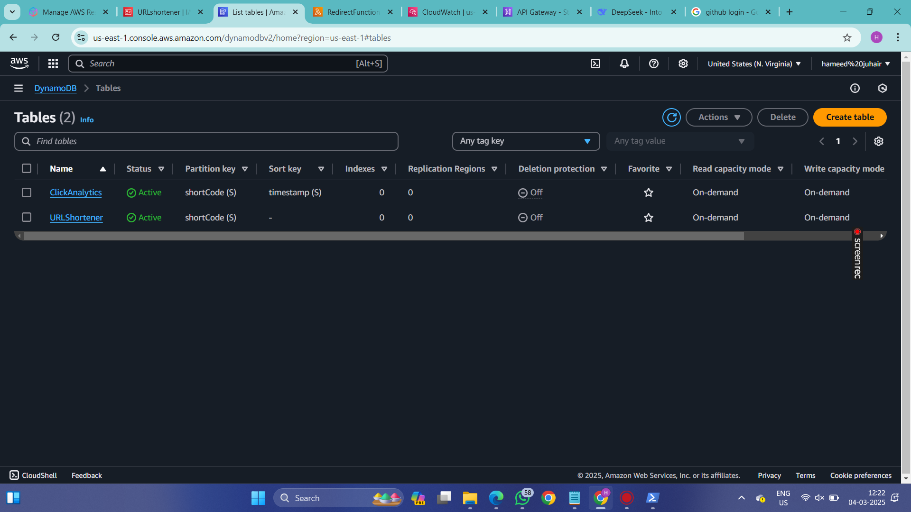

Project: Serverless URL Shortener with Analytics (AWS)

Introduction
	
 	🎯 What I Built:
	A serverless URL shortener that converts long URLs into short codes (e.g., https://gooogle.com/).
	📊 Analytics: Tracks clicks per short URL using DynamoDB.
	☁️ Why Serverless?: Cost-effective, scalable, and fully managed by AWS.

2. Tools & Technologies

         AWS Lambda: Hosts logic for shortening URLs and redirecting users.

         Amazon DynamoDB: Stores short codes and click analytics.

         API Gateway: Creates HTTP endpoints for the URL shortener.

         Python: Backend logic for Lambda functions.

3. step by step process to create url shortener

		Step 1: Setup DynamoDB Tables

		Created URLShortener table:

		Partition Key: shortCode (String).

		Created ClickAnalytics table (optional):

		Partition Key: shortCode, Sort Key: timestamp.
                

		Step 2: Lambda Functions

		ShortenURLFunction:
		Task: Generates a random 6-character code (e.g., abc123).

		RedirectFunction:
		Task: Redirects users to the original URL and logs clicks.

		Step 3: API Gateway Configuration
		Created HTTP API named URLShortenerAPI.

		Defined routes:

		POST /shorten → Triggers ShortenURLFunction.

		GET /{short_code} → Triggers RedirectFunction.

		Enabled Lambda Proxy Integration for both routes.

		Step 4: Testing
		Shorten a URL:
				Invoke-RestMethod `-Uri "https://dqhx3wpwq3.execute-api.us-east-1.amazonaws.com/prod/shorten" ` -Method POST ` -Headers @{ "Content-Type" = "application/json" } `-Body (ConvertTo-Json @{ "url" = "https://www.google.com/" })
		
		Sample Response:
				https://dqhx3wpwq3.execute-api.us-east-1.amazonaws.com/prod/qFR0jP

4. Challenges & Solutions

		🔧 Challenge 1: Lambda permissions errors.

		Fix: Added IAM policies for DynamoDB access.

		🔧 Challenge 2: Short code collisions.

		Fix: Added a loop to regenerate codes until unique.

		🔧 Challenge 3: API Gateway CORS errors.

		Fix: Added CORS headers to Lambda responses.

6. Final Output Demo

		Shortening Flow:
			User submits URL → API Gateway → Lambda → DynamoDB → Returns short 	URL.

		Redirection Flow:
			User clicks short URL → API Gateway → Lambda → Fetch from DynamoDB 	→ Redirect.

