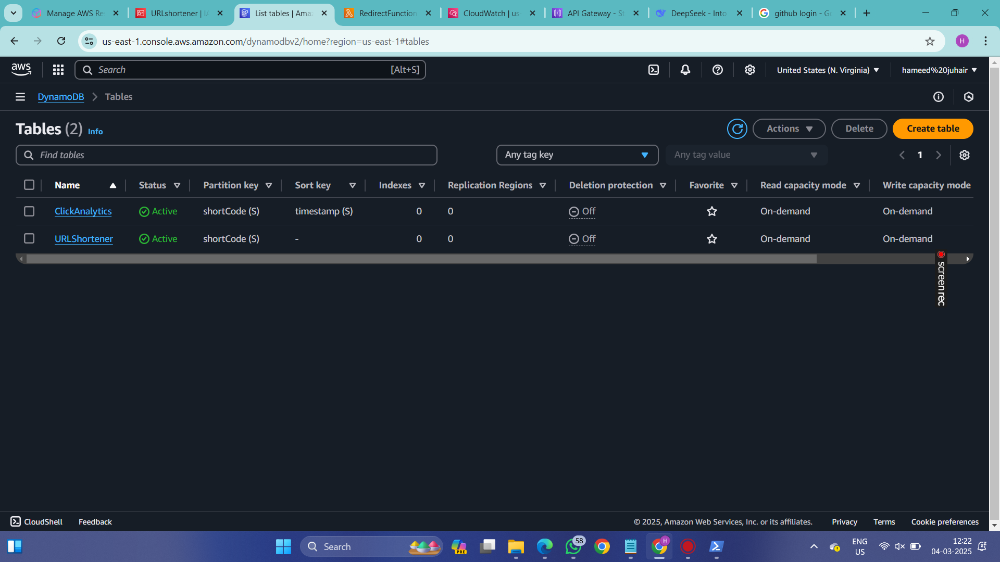
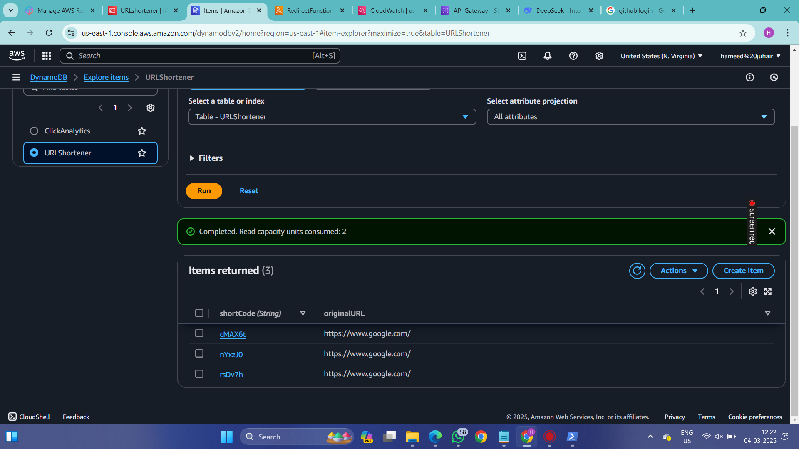
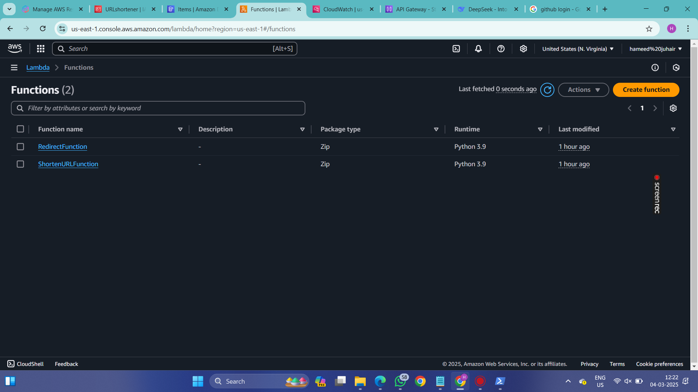
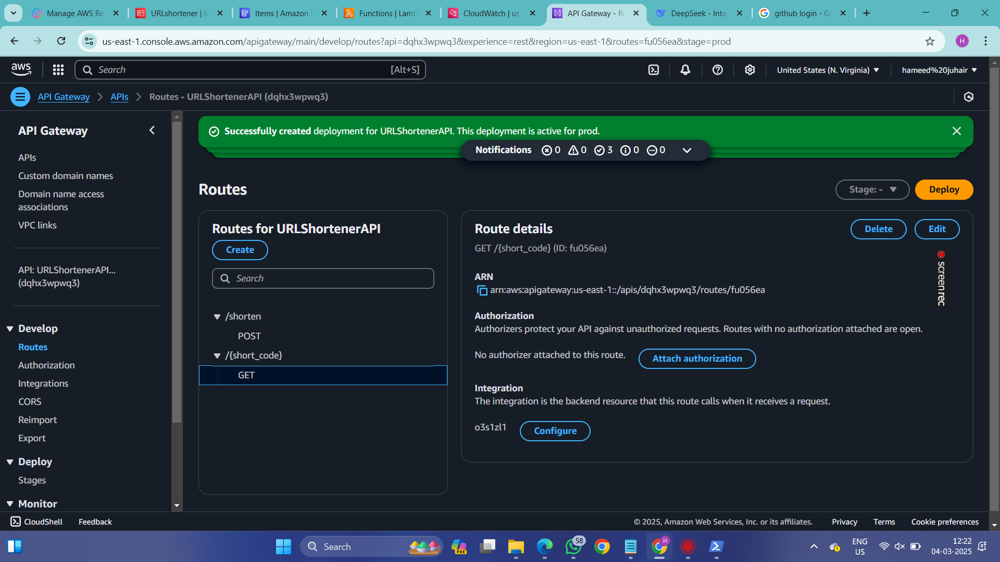
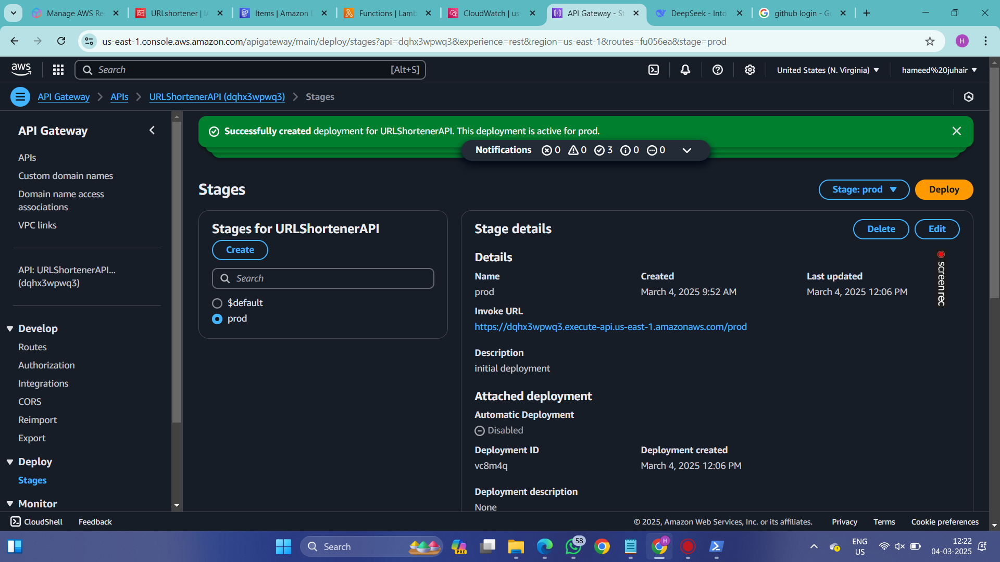
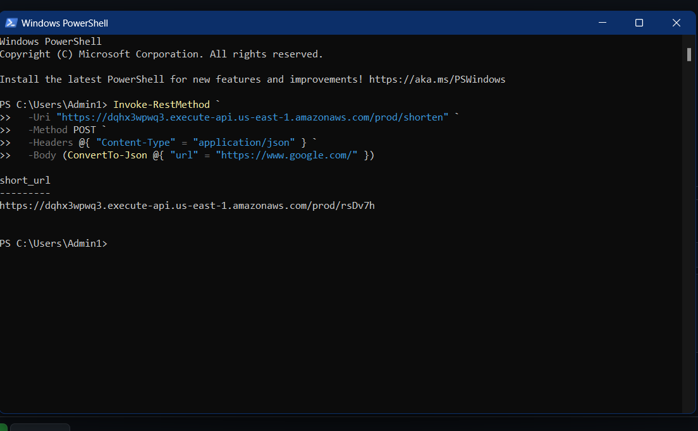

# Serverless URL Shortener with Analytics (AWS)

## 🚀 Introduction

### 🎯 What I Built:

- A serverless URL shortener that converts long URLs into short codes (e.g., `https://google.com/` → `https://short.ly/abc123`).
- 📊 **Analytics**: Tracks clicks per short URL using DynamoDB.
- ☁️ **Why Serverless?** Cost-effective, scalable, and fully managed by AWS.

---

## 🔧 Tools & Technologies

- **AWS Lambda** – Hosts logic for shortening URLs and redirecting users.
- **Amazon DynamoDB** – Stores short codes and click analytics.
- **API Gateway** – Creates HTTP endpoints for the URL shortener.
- **Python** – Backend logic for Lambda functions.

---

## 🛠 Step-by-Step Process to Create URL Shortener

### **Step 1: Setup DynamoDB Tables**

- **Created `URLShortener` Table**
  - Partition Key: `shortCode` (String).
- **Created `ClickAnalytics` Table (Optional)**
  - Partition Key: `shortCode`
  - Sort Key: `timestamp`




---

### **Step 2: Lambda Functions**

- **`ShortenURLFunction`**
  - Generates a random 6-character code (e.g., `abc123`).
- **`RedirectFunction`**
  - Redirects users to the original URL and logs clicks.



---

### **Step 3: API Gateway Configuration**

- **Created HTTP API:** `URLShortenerAPI`
- **Defined Routes:**
  - `POST /shorten` → Triggers `ShortenURLFunction`
  - `GET /{short_code}` → Triggers `RedirectFunction`
- **Enabled Lambda Proxy Integration**




---

### **Step 4: Testing**

#### **Shorten a URL**

```powershell
Invoke-RestMethod `
-Uri "https://your-api-gateway-url/prod/shorten" `
-Method POST `
-Headers @{ "Content-Type" = "application/json" } `
-Body (ConvertTo-Json @{ "url" = "https://www.google.com/" })
```

#### **Sample Response**

```
https://your-api-gateway-url/prod/qFR0jP
```



---

## 🛠 Challenges & Solutions

| Challenge                        | Solution                                       |
| -------------------------------- | ---------------------------------------------- |
| 🔧 **Lambda permissions errors** | Added IAM policies for DynamoDB access.        |
| 🔧 **Short code collisions**     | Added a loop to regenerate codes until unique. |
| 🔧 **API Gateway CORS errors**   | Added CORS headers to Lambda responses.        |

---

## 🎬 Final Output Demo

### **Shortening Flow:**

`User submits URL → API Gateway → Lambda → DynamoDB → Returns short URL`

### **Redirection Flow:**

`User clicks short URL → API Gateway → Lambda → Fetch from DynamoDB → Redirect`

---

## 🔜 Next Steps

- ✅ Ensure all images exist in the `images` folder.
- ✅ Update the actual API Gateway URL before deploying.
- ✅ Consider adding a deployment guide or Terraform script.

---

💡 *Feel free to contribute, suggest improvements, or fork this project!* 🚀

